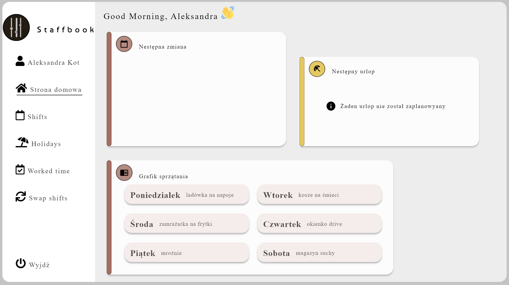
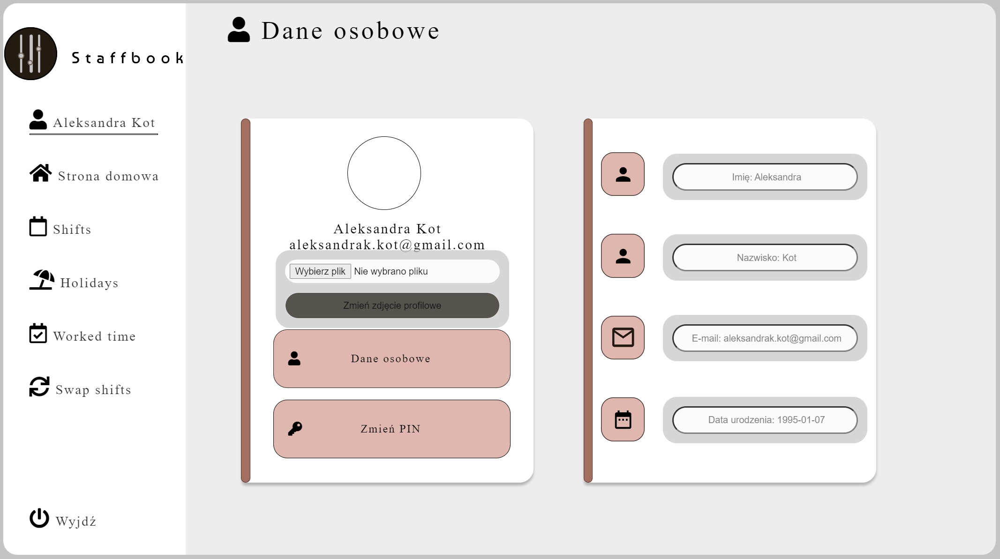

# PAI
PHP project description \
Title: STAFFBOOK \
Introduction: Aplikacja do zarządzania danymi pracowinka (~payroll) \
Technologies: CCS,PHP,JS \
Launch: połączenie z kontenerem docker oraz uruchomienie kontenera -> docker-compose up 

Generalne wydoki i zastosowanie: \
register -> rejestracja użytkownika (validacja danych) \

login -> logowanie pracownika, wpisywanie emialu i hasała (metoda POST, GET) \

homepage -> dane o nastepnej zmianie, grafik sprzątania, urlop \

user -> dane o użytkowniku pobranych z bazy danych (upload zdjęcia)\

shifts -> zmiany na cały miesiąc, konketne godziny i dni \
holidays -> zaplanowany urlop  \
workedtime -> podumowanie zmian w ciągu miesiąca, podgląd do wypłat\
swap -> zamiana zmianami, dodanie prośby o zamianę 

